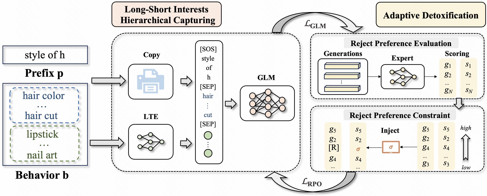

Personalized Query Auto-Completion for Long and Short-Term Interests with Adaptive Detoxification Generation
====================================



<p align="center">Overall structure of the LaD.</p>


This is a PyTorch implementation for [Personalized Query Auto-Completion for Long and Short-Term Interests with Adaptive Detoxification Generation, KDD-2025].


  * [Data](#Data)


If you use this code in your research, please consider citing:

```text
@inproceedings{wang2025lad,
  title =  {Personalized Query Auto-Completion for Long and Short-Term Interests with Adaptive Detoxification Generation},
  author =  {Wang, Zhibo and Jiang, Xiaoze and Qin, Zhiheng and Yu, Enyun and Li, Han},
  year =  {2025},
  booktitle = {Proceedings of the 31st ACM SIGKDD Conference on Knowledge Discovery and Data Mining V.2 (KDD '25), August 3--7, 2025, Toronto, ON, Canada}
}
```

Data
----------------------
```sh
for data example
```
